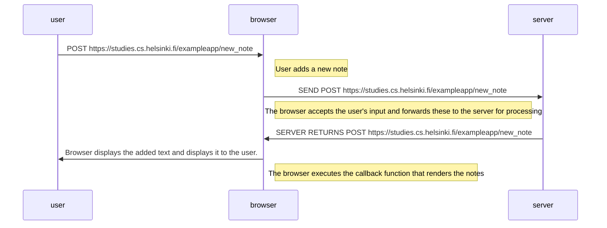

```mermaid

sequenceDiagram
    participant user
    participant browser
    participant server

    user ->>browser: POST https://studies.cs.helsinki.fi/exampleapp/new_note

    Note right of browser: User adds a new note

    browser ->>server: SEND POST https://studies.cs.helsinki.fi/exampleapp/new_note

    Note right of browser: The browser accepts the user's input and forwards these to the server for processing

    server ->>browser: SERVER RETURNS POST https://studies.cs.helsinki.fi/exampleapp/new_note

    browser ->>user: Browser displays the added text and displays it to the user.

    Note right of browser: The browser executes the callback function that renders the notes

```
